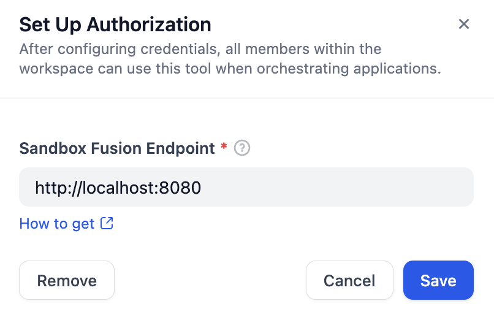
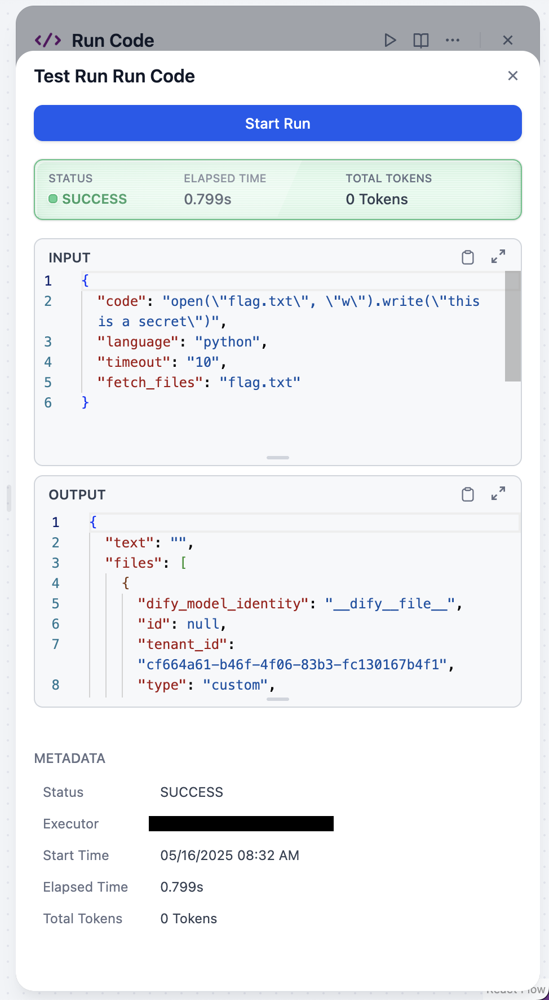
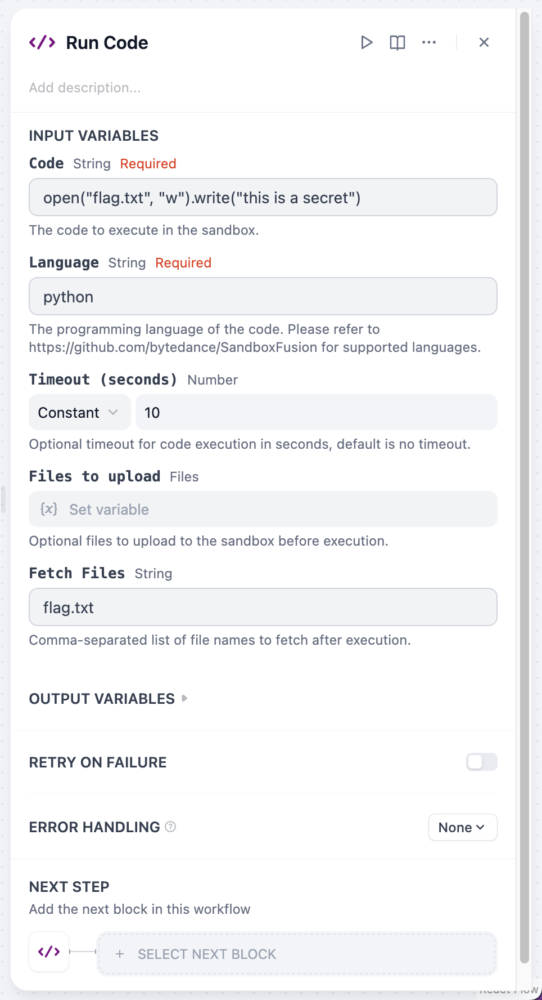

## dify-plugin-SandboxFusion

**Author:** jingfelix

**Version:** 0.0.1

**Type:** tool

### Description

> [!WARNING]
> Sandbox Fusion does not support fine-grained permission control, so it should be used with caution in production environments (preferably avoided).

Sandbox Fusion is a tool that allows you to run and test your code in a sandboxed environment, developed by Bytedance. You can think of it as an alternative to DifySandbox that supports more languages but offers weaker security.

### Usage

1. Install SandboxFusion to your local machine. You can find the installation instructions in the [SandboxFusion repository](https://github.com/Bytedance/SandboxFusion). We recommend using the Docker version for simplicity.

    ```bash
    docker run -it -p 8080:8080 volcengine/sandbox-fusion:server-20241204
    ```

2. Install the plugin and setup the configuration.

<div align="center">
    
</div>

3. Tool `run_code` offers several parameters to customize the execution environment.
    - `code`: The code to be executed.
    - `language`: The programming language of the code. Supported languages: `[ python, cpp, nodejs, go, go_test, java, php, csharp, bash, typescript, sql, rust, cuda, lua, R, perl, D_ut, ruby, scala, julia, pytest, junit, kotlin_script, jest, verilog, python_gpu, lean, swift, racket]`
    - `timeout`: The maximum time (in seconds) the code is allowed to run. Default is None.
    - `files`: To upload files to the execution environment, you need to bind the files to node *variables*. In the execution code, retrieve the corresponding content using the file name. Please note the default file size limit for uploads in Dify.
    - `fetch_files`: A comma-separated list of filenames to download. After execution, the files will be output to the files variable of the output node.

An example of using the `run_code` tool:

<div align="center">
    
    
</div>

### Comparison with DifySandbox

|                         | SandboxFusion                   | DifySandbox                     |
|-------------------------|---------------------------------|----------------------------------|
| # Datasets              | 10+                             | 0                                |
| # Languages             | 23                              | 2                                |
| Security                | namespace & cgroup              | seccomp                          |
| API Type                | HTTP & SDK                      | HTTP                             |
| Deployment              | Single Server                   | Single Server                    |
| Others                  | Jupyter Mode (Not supported yet)| Fine-Grained Limitation Security |

### FAQ

1. How can I install custom libraries in the sandbox?

    SandboxFusion does not support installing custom libraries dynamically. However, you can create a custom Docker image with the required libraries pre-installed and use that image to run your code. You can find more information on how to create a custom Docker image in the [SandboxFusion documentation](https://github.com/bytedance/SandboxFusion?tab=readme-ov-file#installation).

2. How can I use SandboxFusion with cloud.dify.ai?

    You need to make sure that the SandboxFusion server is accessible from the cloud.dify.ai environment.

### TODO

- [ ] Support jupyter mode
- [ ] Support calling benchmarks

Last updated: 2025-05-16
